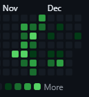

# EcoGestUM

L'objectif principal est de développer une application qui centralise la gestion du recyclage des équipements et du matériel (meubles, matériel informatique, livres, etc.) au sein de l'Université du Mans dans le cadre de la Situation d'Apprentissage et d'évaluation du semestre 3 du BUT Informatique. Il fut réalisé en groupe de 3 avec 120h/personne.

# Mise en place du projet

1 - clone le repository dans le htdocs dans les dossiers de xampp : git clone https://github.com/rioulantoine/EcoGestUM.git

2 - ouvrez un terminal a la racine du repository et y mettre les commandes suivantes :

    - composer init
    - composer require vlucas/phpdotenv

skippez tout sauf type of project ou vous mettez "project"

3 - Ouvrez xampp, lancer apache ainsi que phpMyAdmin et importez le script de création dans le dossier SQL puis celui d'insertion

# Projet SAE – Application Web de Gestion

## Description

Ce projet est une application web développée en PHP suivant une architecture MVC avec les langages suivants : PHP, HTML, CSS, JavaScript.

## Description

## Mettre en avant le tri au sein de l'Unniversité du Mans.

## Accès au serveur actuellement activé et accessible de tous (21/01/2026)

- **Adresse du serveur :**  
  https://ecogestum.lvm-labs.com

---

## URLs de l’application

Base de l’URL :  
https://ecogestum.lvm-labs.com/

---

### Pages publiques

- Accueil  
  https://ecogestum.lvm-labs.com/accueil

- Connexion  
  https://ecogestum.lvm-labs.com/connexion

# EcoGestUM

L'objectif principal est de développer une application qui centralise la gestion du recyclage des équipements et du matériel (meubles, matériel informatique, livres, etc.) au sein de l'Université du Mans dans le cadre de la Situation d'Apprentissage et d'évaluation du semestre 3 du BUT Informatique. Il fut réalisé en groupe de 3 avec 120h/personne.

# Mise en place du projet

1 - clone le repository dans le htdocs dans les dossiers de xampp : git clone https://github.com/rioulantoine/EcoGestUM.git

2 - ouvrez un terminal a la racine du repository et y mettre les commandes suivantes :

- composer init
- composer require vlucas/phpdotenv

skippez tout sauf type of project ou vous mettez "project"

3 - Ouvrez xampp, lancer apache aisni que phpMyAdmin et importez le script de création dans le dossier SQL puis celui d'insertion

# Projet SAE – Application Web de Gestion

## Description

Ce projet est une application web développée en PHP suivant une architecture MVC avec les langages suivants : PHP, HTML, CSS, JavaScript.

## Description

## Mettre en avant le tri au sein de l'Unniversité du Mans.

## Accès au serveur actuellement activé et accessible de tous (21/01/2026)

- **Adresse du serveur :**  
  https://ecogestum.lvm-labs.com

---

-**Statistiques du projet**
rioulantoine --> 78 commits
jaajjj --> 58 commits
MarhadourM --> 17 commits

---

## URLs de l’application

Base de l’URL :  
https://ecogestum.lvm-labs.com/

---

### Pages publiques

- Accueil  
  https://ecogestum.lvm-labs.com/accueil

- Connexion  
  https://ecogestum.lvm-labs.com/connexion

- Inscription  
  https://ecogestum.lvm-labs.com/inscription

- Mot de passe oublié  
  https://ecogestum.lvm-labs.com/mot-de-passe-oublie.php

- Politique de confidentialité  
  https://ecogestum.lvm-labs.com/notre-politique

- Objectifs  
  https://ecogestum.lvm-labs.com/objectifs

- Carte  
  https://ecogestum.lvm-labs.com/carte

- Événements  
  https://ecogestum.lvm-labs.com/evenements

- Communications officielles  
  https://ecogestum.lvm-labs.com/communications

---

### Espace utilisateur

- Profil  
  https://ecogestum.lvm-labs.com/profil

- Notifications  
  https://ecogestum.lvm-labs.com/notifications

- Messagerie  
  https://ecogestum.lvm-labs.com/messagerie

- Mes réservations  
  https://ecogestum.lvm-labs.com/mesReservation

- Mes inscriptions  
  https://ecogestum.lvm-labs.com/mesInscriptions

---

### Recherche et gestion d’objets

- Recherche d’objets  
  https://ecogestum.lvm-labs.com/rechercheObjet

- Formulaire de besoin d’objet  
  https://ecogestum.lvm-labs.com/form-besoin-objet

- Besoins objets enseignants  
  https://ecogestum.lvm-labs.com/besoins-objet-enseignants

- Formulaire de don  
  https://ecogestum.lvm-labs.com/formDon

- Signalement d’objet  
  https://ecogestum.lvm-labs.com/signalementObj

---

### Réservations

- Récupérer une réservation  
  https://ecogestum.lvm-labs.com/recuperer_reservation

---

### Statistiques et rapports

- Statistiques  
  https://ecogestum.lvm-labs.com/statistiques

- Télécharger un rapport  
  https://ecogestum.lvm-labs.com/telecharger_rapport

---

### Dashboard (selon le rôle)

- Dashboard principal  
  https://ecogestum.lvm-labs.com/dashboard

#### Présidence

- Accueil  
  https://ecogestum.lvm-labs.com/dashboard

- Impact  
  https://ecogestum.lvm-labs.com/dashboard&section=impact

- Communication  
  https://ecogestum.lvm-labs.com/dashboard&section=communication

- Rapport  
  https://ecogestum.lvm-labs.com/dashboard&section=rapport

#### Chef de département

- Accueil  
  https://ecogestum.lvm-labs.com/dashboard

- Inventaire  
  https://ecogestum.lvm-labs.com/dashboard&section=inventaire

- Communication  
  https://ecogestum.lvm-labs.com/dashboard&section=communication

- Impact  
  https://ecogestum.lvm-labs.com/dashboard&section=impact

- Historique  
  https://ecogestum.lvm-labs.com/dashboard&section=historique

Le routage est entièrement géré dans le fichier `index.php` (routeur principal).

### phpMyAdmin

- **URL phpMyAdmin :**  
  https://ecogestum.lvm-labs.com/phpmyadmin

> Les identifiants de la base de données sont définis dans le fichier `.env` et ne sont pas inclus directement dans le dépôt pour des raisons de sécurité.

---

## Comptes utilisateurs de test

L’application propose trois rôles distincts :

- Présidence de l’université
- Chef de département
- Enseignant

### Présidence de l’université

- **Login :** monsieur.poisson@univ-lemans.fr  
  **Mot de passe :** mpois1980

- **Login :** alice.dupont@univ-lemans.fr  
  **Mot de passe :** adupo1987

### Chef de département

- **Login :** olivier.roulin@univ-lemans.fr  
  **Mot de passe :** oroul2019

- **Login :** julien.grand@univ-lemans.fr  
  **Mot de passe :** jgran2015

### Enseignant

- **Login :** guillaume.marcel@univ-lemans.fr  
  **Mot de passe :** gmarc2020

- **Login :** juliette.lemoine@univ-lemans.fr  
  **Mot de passe :** jlemo2024

---

## Fonctionnement général

- Le fichier `index.php` joue le rôle de **routeur principal**
- Les paramètres `page`, `section` et `action` permettent de charger :
  - les vues (`/src/view`)
  - les contrôleurs (`/src/Controller`)
  - les modèles (`/src/Model`)
- Les rôles utilisateurs déterminent l’accès aux différentes sections du dashboard

---

## Technologies utilisées

- PHP 8
- MySQL / MariaDB
- phpMyAdmin
- HTML / CSS
- JavaScript
- Composer (autoload)
- Dotenv pour la gestion des variables d’environnement

---

## Remarques

Ce dépôt contient uniquement le code source de l’application.
Les fichiers sensibles (comme `.env`) ne doivent pas être partagés publiquement.

---

© Université du Mans – SAE S3
https://lainf-sae3-6.univ-lemans.fr/inscription

- Mot de passe oublié  
  https://lainf-sae3-6.univ-lemans.fr/mot-de-passe-oublie.php

- Politique de confidentialité  
  https://lainf-sae3-6.univ-lemans.fr/notre-politique

- Objectifs  
  https://lainf-sae3-6.univ-lemans.fr/objectifs

- Carte  
  https://lainf-sae3-6.univ-lemans.fr/carte

- Événements  
  https://lainf-sae3-6.univ-lemans.fr/evenements

- Communications officielles  
  https://lainf-sae3-6.univ-lemans.fr/communications

---

### Espace utilisateur

- Profil  
  https://lainf-sae3-6.univ-lemans.fr/profil

- Notifications  
  https://lainf-sae3-6.univ-lemans.fr/notifications

- Messagerie  
  https://lainf-sae3-6.univ-lemans.fr/messagerie

- Mes réservations  
  https://lainf-sae3-6.univ-lemans.fr/mesReservation

- Mes inscriptions  
  https://lainf-sae3-6.univ-lemans.fr/mesInscriptions

---

### Recherche et gestion d’objets

- Recherche d’objets  
  https://lainf-sae3-6.univ-lemans.fr/rechercheObjet

- Formulaire de besoin d’objet  
  https://lainf-sae3-6.univ-lemans.fr/form-besoin-objet

- Besoins objets enseignants  
  https://lainf-sae3-6.univ-lemans.fr/besoins-objet-enseignants

- Formulaire de don  
  https://lainf-sae3-6.univ-lemans.fr/formDon

- Signalement d’objet  
  https://lainf-sae3-6.univ-lemans.fr/signalementObj

---

### Réservations

- Récupérer une réservation  
  https://lainf-sae3-6.univ-lemans.fr/recuperer_reservation

---

### Statistiques et rapports

- Statistiques  
  https://lainf-sae3-6.univ-lemans.fr/statistiques

- Télécharger un rapport  
  https://lainf-sae3-6.univ-lemans.fr/telecharger_rapport

---

### Dashboard (selon le rôle)

- Dashboard principal  
  https://lainf-sae3-6.univ-lemans.fr/dashboard

#### Présidence

- Accueil  
  https://lainf-sae3-6.univ-lemans.fr/dashboard

- Impact  
  https://lainf-sae3-6.univ-lemans.fr/dashboard&section=impact

- Communication  
  https://lainf-sae3-6.univ-lemans.fr/dashboard&section=communication

- Rapport  
  https://lainf-sae3-6.univ-lemans.fr/dashboard&section=rapport

#### Chef de département

- Accueil  
  https://lainf-sae3-6.univ-lemans.fr/dashboard

- Inventaire  
  https://lainf-sae3-6.univ-lemans.fr/dashboard&section=inventaire

- Communication  
  https://lainf-sae3-6.univ-lemans.fr/dashboard&section=communication

- Impact  
  https://lainf-sae3-6.univ-lemans.fr/dashboard&section=impact

- Historique  
  https://lainf-sae3-6.univ-lemans.fr/dashboard&section=historique

Le routage est entièrement géré dans le fichier `index.php` (routeur principal).

### phpMyAdmin

- **URL phpMyAdmin :**  
  https://lainf-sae3-6.univ-lemans.fr/phpmyadmin

> Les identifiants de la base de données sont définis dans le fichier `.env` et ne sont pas inclus directement dans le dépôt pour des raisons de sécurité.

---

## Comptes utilisateurs de test

L’application propose trois rôles distincts :

- Présidence de l’université
- Chef de département
- Enseignant

### Présidence de l’université

- **Login :** monsieur.poisson@univ-lemans.fr  
  **Mot de passe :** mpois1980

- **Login :** alice.dupont@univ-lemans.fr  
  **Mot de passe :** adupo1987

### Chef de département

- **Login :** olivier.roulin@univ-lemans.fr  
  **Mot de passe :** oroul2019

- **Login :** julien.grand@univ-lemans.fr  
  **Mot de passe :** jgran2015

### Enseignant

- **Login :** guillaume.marcel@univ-lemans.fr  
  **Mot de passe :** gmarc2020

- **Login :** juliette.lemoine@univ-lemans.fr  
  **Mot de passe :** jlemo2024

---

## Fonctionnement général

- Le fichier `index.php` joue le rôle de **routeur principal**
- Les paramètres `page`, `section` et `action` permettent de charger :
  - les vues (`/src/view`)
  - les contrôleurs (`/src/Controller`)
  - les modèles (`/src/Model`)
- Les rôles utilisateurs déterminent l’accès aux différentes sections du dashboard

---

## Technologies utilisées

- PHP 8
- MySQL / MariaDB
- phpMyAdmin
- HTML / CSS
- JavaScript
- Composer (autoload)
- Dotenv pour la gestion des variables d’environnement

---

## Remarques

Ce dépôt contient uniquement le code source de l’application.
Les fichiers sensibles (comme `.env`) ne doivent pas être partagés publiquement.

---

© Université du Mans – SAE S3
